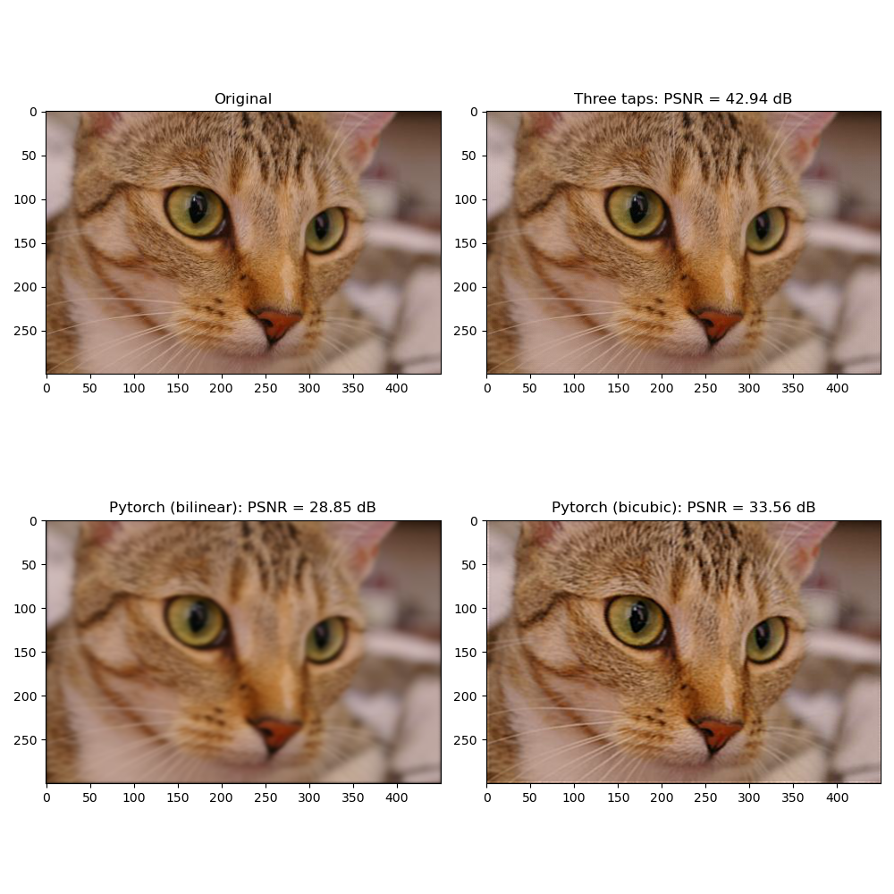

# High-quality Pytorch image and volume rotation

This repo contains a Pytorch implementation of the high-quality 
convolution-based rotation
introduced in IEEE TIP'95: "Convolution-Based Interpolation for Fast, 
High-Quality Rotation of Images" by Michael Unser, Philipe Thevenaz and 
Leonid Yaroslavsky [[paper]](https://perso.telecom-paristech.fr/angelini/SI241/papers_for_project/yaro_rot.pdf).

This implementation comes with a rotation method working for 4D and 5D tensors
of shape (B,C,H,W) or (B,C,L,H,W).
You can try the code by running
```bash
python main.py
```
and compare to pytorch interpolation functions with
```bash
python benchmark.py
```
In your python code, call the rotation function as follows:
```python
import torch
import math

from torch_rotation import rotate_three_pass  # same function for 4D and 5D tensor!

I = torch.rand(10, 3, 128, 128)  # mock image (could be a mock volume too.)
angle = 30 * math.pi / 180  # the angle should be in radian.

I_rot = rotate_three_pass(I, angle)  # By default do FFT-based interpolation.
```

Not that for the moment this package supports only the
[basic 3D rotation](https://en.wikipedia.org/wiki/Rotation_matrix#Basic_3D_rotations)
where the rotation $\theta$ is the same around each x,y and z-axis. In the future,
the [general 3D rotation](https://en.wikipedia.org/wiki/Rotation_matrix#General_3D_rotations) 
will be supported.

## What's up with this approach?

A 2D rotation matrix of angle $\theta$ is defined as:
```math
R(\theta) = \begin{bmatrix} \cos(\theta) & -\sin(\theta) \\ \sin(\theta) & \cos(\theta) \end{bmatrix}.
```
Applying this transform matrix is done with 2D warp routines relying
on bilinear or bicubic interpolation, for instance in OpenCV or Pytorch. 
The authors of the paper above remarked that a threefold decomposition of 
$R(\theta)$ exists:
```math
R(\theta) =  
\begin{bmatrix}
    1 & -\tan(\theta/2) \\
    0 & 1
\end{bmatrix}
\times
\begin{bmatrix}
    1 & 0 \\
    \sin(\theta) & 1
\end{bmatrix}
\times
\begin{bmatrix}
    1 & -\tan(\theta/2) \\
    0 & 1
\end{bmatrix}.
```
This converts the 2D warp into three consecutive 1D shears, with no intermediate rescaling.
This prevents losing too much details during the rotation process, and it
can be efficiently implemented with row or column-wise translations.

This method extends naturally to the 3D case by applying the 2D rotation matrix around
each axis of the space.


## Installation

It can be installed from pypi with
```bash
pip install pytorch_rotation
```
or from source with
```bash
python setup.py install
```


## Illustration

An image is worth a thousand words. Below you will find a simple experiment
from the TIP paper consisting of rotating 16 times by $22.5^\circ$ an image
with bilinear and bicubic interpolation (from pytorch) and the proposed
three-pass approach, and comparing to the original image.



The three-tap approach (I used the FFT-based approach) is an order of 
magnitude of MSE more accurate than bicubic interpolation, usually featured
to implement rotations.


## Troubleshooting

Please open an issue to report any bug.
